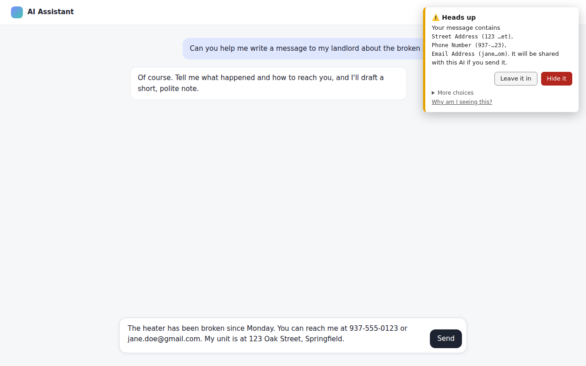
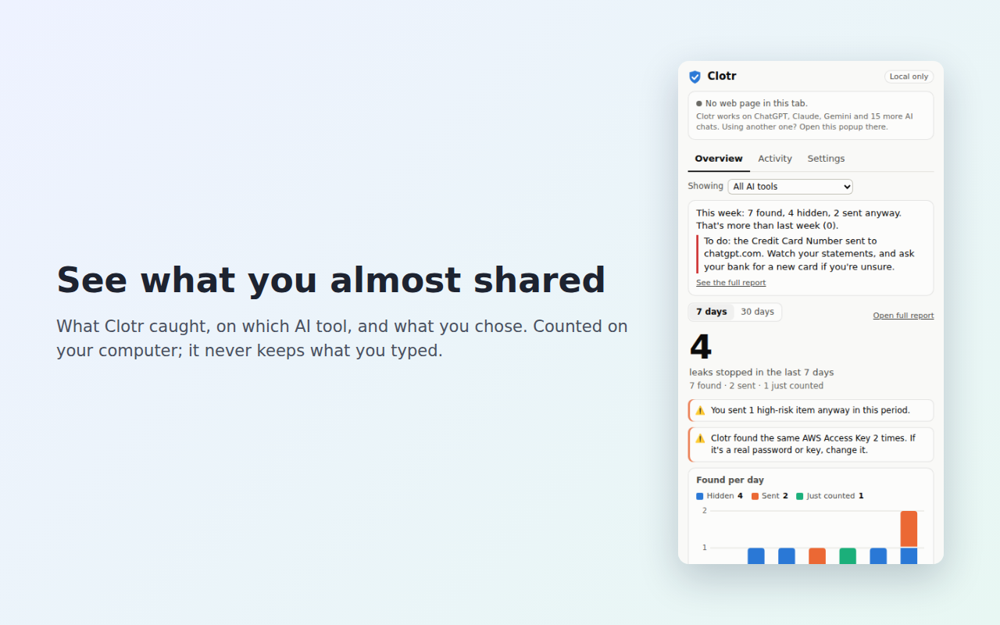

# Clotr AI Privacy Guard

**Clotr warns you before you send a password, a key or a personal detail to an AI chat**, like ChatGPT,
Claude, Gemini, Copilot or Perplexity. You decide: hide it, or send it anyway.

It is built for people who don't think of "my phone number, spelled out" as sensitive: it catches personal
details however they're written (digits, number words, misspellings, mixes), and it explains itself in plain words.

> **Status: alpha (0.9.x).** It works in Chrome, Brave and Microsoft Edge on a computer. Expect rough edges; please report them.

## What it catches
Everything is checked on your computer, in what you type or paste into an AI chat, before you send it:
- **Passwords and keys:** passwords however they're phrased, API keys (OpenAI, Anthropic, GitHub, AWS, Google, Stripe,
  Slack, Hugging Face, npm and many more), tokens and session cookies in pasted `curl` commands, webhook URLs,
  connection strings, crypto wallet seed phrases and keys.
- **Personal details:** phone numbers, emails, street addresses and dates of birth, even spelled out ("nine three
  seven…"), plus answers to security questions ("my mother's maiden name is…") and door, alarm and card codes.
- **ID and money numbers:** card numbers, Social Security and ITIN, bank account numbers and IBANs, medical record
  numbers, and national IDs (UK incl. NHS, Canada, India's Aadhaar, Australia's TFN and Medicare, Spain's DNI/NIE and
  social security number, Mexico's CURP and RFC).
- **What scammers ask for:** a sign-in code texted to you, a card's security code, a remote-access code ("the AnyDesk
  code is…"), two-factor backup codes, so a message copied from a "support call" gets a second look.
- **Your own list:** your name, family, addresses, phones and employer, entered once in your *vault*. Clotr keeps only
  one-way fingerprints of them, never the details themselves.
- **Attachments:** text files, PDFs and Word, Excel and PowerPoint documents.

## What it does about it
- **Warns in the corner** by default and never stops you. You can choose, per kind of data, to be asked before
  sending instead, or to just have it counted.
- **A dashboard** in its toolbar button: what it caught, where, and what you did, with a short "this week" summary.
- **A full report** ("Your AI exposure report"): what each AI service has been told about you over time, a map of where
  your details went, the riskiest moments with what to do now, and export or delete your history.
- **Setting it up for someone else**: larger warnings, a stricter setting for personal details, and a PIN so
  settings aren't changed by accident.
- **Notices when an AI brings up your details**: if a reply mentions your own phone number or name that you
  didn't type on that page, Clotr points it out: the AI may have it from an earlier chat or its memory.
- **In English and Spanish**: warnings, the dashboard and the welcome page follow your browser's language, and
  Spanish is understood too ("mi contraseña es…", "seis cero cero…", Spanish addresses and ID numbers).
- **For teams**: IT can roll Clotr out with required settings and company watch words through the browser's
  policy ([docs/team-rollout.md](docs/team-rollout.md)). Nothing is ever reported back to anyone.
- **It tells you when it can't help**: the popup says whether Clotr can see the chat box on this page, and the toolbar
  shows a red **!** if a chat box refused Clotr's edit or a page removed its warnings.

## Privacy guarantees
- **Nothing leaves your computer.** Clotr has no servers, no analytics and makes no network requests (checked
  automatically on every change).
- **It never stores what you type.** It keeps a short record of *what kind* of thing it found, on which AI site,
  when, and what you chose, plus a salted one-way fingerprint so it can tell "the same thing again". You can see
  every stored record in Settings → History → *See exactly what's stored*, and clear it any time.
- **It only runs on AI chat sites.** Never on your email, bank or other websites. A new AI tool is protected only
  after you click *Protect this site* and approve that one site.

Known limits are listed on the "What Clotr stores" page and in [docs/security-review.md](docs/security-review.md).

## Install (alpha)
1. Download the latest `clotr-<version>.zip` from Releases and unzip it (or clone this repository).
2. Open `chrome://extensions` (or `brave://extensions`), turn on **Developer mode** (top right).
3. Click **Load unpacked** and choose the unzipped folder (the one with `manifest.json`; in a clone, `ai-privacy-guard/`).
4. Pin Clotr to the toolbar. A welcome page opens with a practice box.

### Browsers and devices
| Where | Status |
|---|---|
| Chrome, Brave (Windows, Mac, Linux) | Supported; every change is tested automatically in both |
| Microsoft Edge | Supported; the full automatic test suite passes in Edge 153. Copilot in Edge's *sidebar* can't be checked by any extension; copilot.microsoft.com in a tab is covered |
| Firefox (computer and Android) | Works: `npm run package -- --firefox` makes a Firefox build (Firefox 140+, Android 142+) that passes Mozilla's checks and an automatic test in Firefox 156. Firefox for Android is the one phone browser that runs extensions. The amber "AI chat spotted" dot isn't available there; the popup's page check is |
| iPhone / iPad | Planned as a Safari extension (needs Apple's paid developer program) |
| Chrome / Brave on Android | Not possible: they don't run extensions |

## Permissions, in plain words
| Permission | Why |
|---|---|
| Read and change data on the built-in AI chat sites | To check what you type there and replace it when you click *Hide it*, and to start the new version in AI tabs you already have open after an update, so you never need to reload them. That list is in `ai-privacy-guard/ai-sites.json`. |
| Storage | To keep your settings, your vault's fingerprints and the history of what was found, on this computer. |
| Active tab | When you open Clotr's popup on an unknown page, to check whether it looks like an AI chat, only then and only that tab. |
| Scripting | To run the one-time "is this an AI chat?" check above, and to start protecting an AI site you added (including tabs already open). |
| Declarative content | To show an amber dot on the toolbar icon when a page looks like an AI chat, without reading the page. |
| Alarms | To refresh the daily count after midnight, remove history older than you chose to keep, and (for developer installs) notice a new version on disk. |
| Optional: one site at a time | Only when you click *Protect this site*: the browser asks you to allow that single site. |

## Reporting problems
Open an issue: *False alarm*, *Missed something* or *Bug*. Never paste the real sensitive value; describe its shape
instead (for example "a phone number written as nine three seven…"). Security problems: see
[SECURITY.md](SECURITY.md) (reported privately, not as an issue).

## How Clotr works, and how it's made
**Rules, not AI, on purpose.** Clotr recognizes private details with ordinary pattern matching: it runs instantly
and offline, gives the same answer every time, and anyone can read exactly what it looks for
(`ai-privacy-guard/patterns.js`). **The extension contains no AI** and sends nothing to any AI service or anywhere
else. Every pattern has tests, including more than 400 everyday messages in English and Spanish, full of numbers that
aren't private (versions, prices, order numbers, times), which must not set off a warning.

**Built with an AI assistant, checked by machines and a person.** Clotr is developed by its author with the help of
an AI coding assistant (Anthropic's Claude); commits made that way say so. Every change goes through automatic
checks: detection tests, rule tests that enforce the privacy guarantees above (no network code, no broad site
access, nothing typed is stored), a real-browser suite and stress tests. The author reviews each public release
before it's published, and releases are reproducible: rebuilding a release from its code gives a byte-identical zip,
whose SHA-256 is published in `SHA256SUMS.txt`.

## License
Clotr is free and open-source software: you may use, study, change and share it under the
[GNU Affero General Public License v3.0 or later](LICENSE). If you share a changed version, or run one for others
over a network, you must share its source code under the same license.

Want to build Clotr's code into a closed-source product or service instead? A **commercial license** is available:
open a *Commercial license* issue. The name Clotr and its logo aren't covered by the license: a changed version you
share needs its own name and icon, so people can tell it apart from Clotr.

Copyright © 2026 BilliamBaSH.

## For developers
`npm install`, then `npm test` (detection and rule checks), `npm run lint` (formatting and lint; `npm run format` fixes
formatting) and `npm run test:e2e` (drives a real browser with the extension loaded). `npm run package` builds the
release zip and its SHA-256 in `dist/SHA256SUMS.txt`. How to help: [CONTRIBUTING.md](CONTRIBUTING.md). How it's put together: [docs/architecture.md](docs/architecture.md). Design decisions: [docs/design-notes.md](docs/design-notes.md). Security: [SECURITY.md](SECURITY.md).
